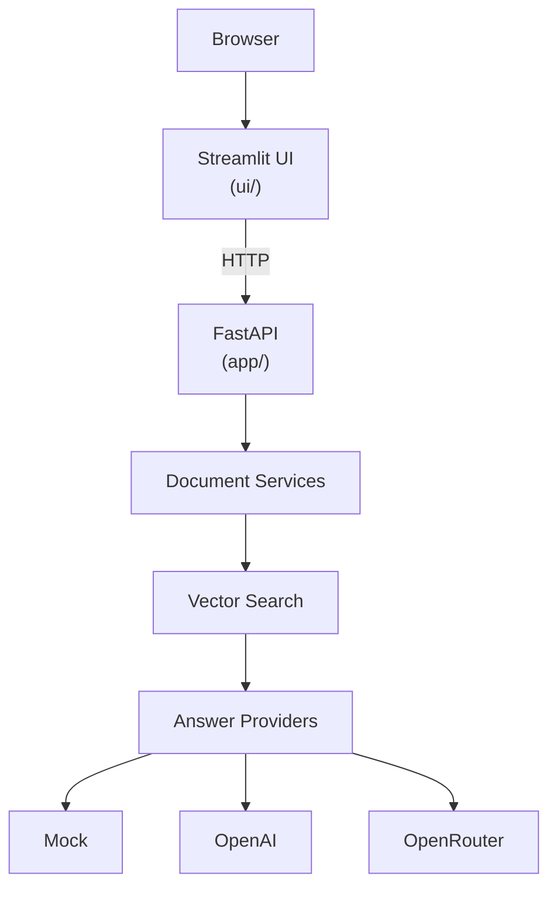

# AI Presales Platform

Enterprise-oriented AI platform for presales automation. The current release is a locally runnable **AI RFP Analyzer** demo: upload an RFP PDF, index it for semantic search, and run presales analyses through a Streamlit UI backed by a FastAPI service.

## Problem statement

Presales teams spend hours reading RFPs to extract requirements, risks, assumptions, and clarification questions before they can estimate or respond. This project automates that first pass with a retrieval-augmented generation (RAG) pipeline over uploaded documents, exposed through a simple demo UI and a versioned HTTP API.

## Architecture



The Streamlit client calls the backend over HTTP only. It does not import application services or share process memory with FastAPI.

See [docs/architecture.md](docs/architecture.md) for layered design, dependency injection, and sequence diagrams.

## Features

- PDF upload with validation (type and size)
- Parse, chunk, embed, and index pipeline
- Project workspaces with multi-document upload, auto-index, search, and Q&A (`/api/v1/projects`)
- AI proposal generator with per-section RAG, caching, and Markdown/DOCX export
- Semantic search with per-chunk source metadata and citations on `/ask`
- RAG question answering with retrieved source chunks
- Presales analysis dashboard (seven preset analyses via `/ask`)
- Pluggable embedding providers: **mock**, **OpenAI**, **Ollama**
- Pluggable answer providers: **mock**, **OpenAI**, **OpenRouter**
- Platform status API for runtime provider metadata
- Interactive OpenAPI docs at `/docs`
- 278 automated tests with isolated configuration

## Technology stack

| Layer | Technology |
| --- | --- |
| API | FastAPI, Uvicorn, Pydantic v2 |
| UI | Streamlit, httpx |
| AI | OpenAI SDK (OpenAI + OpenRouter-compatible) |
| PDF | pypdf |
| Storage | Local filesystem |
| Vector store | `inmemory`, `chroma` (persistent) |
| Tests | pytest, httpx |

**Python:** 3.12

## Folder structure

```text
AI-Presales/
├── app/                          # FastAPI backend
│   ├── main.py                   # Application entry point
│   ├── api/routes.py             # Top-level API routes
│   ├── core/                     # Config, DI, exceptions
│   ├── infrastructure/           # Storage, embeddings, answers, vector store
│   ├── modules/documents/        # Document domain (services, schemas, API)
│   ├── models/                   # Shared response models
│   ├── schemas/                  # Cross-cutting schemas (e.g. status)
│   └── services/                 # Upload and legacy demo analysis
├── ui/                           # Streamlit demo (HTTP client only)
│   ├── app.py                    # Main UI
│   ├── api_client.py             # Backend HTTP helpers
│   ├── analysis_handlers.py      # Analysis button logic
│   ├── config.py                 # UI settings + status merge
│   └── prompts.py                # Preset analysis prompts
├── docs/                         # Project documentation
├── scripts/run_demo.sh           # Start API + Streamlit together
├── tests/                        # Unit and integration tests
├── .env.example                  # Environment variable template
└── requirements.txt
```

## Installation

```bash
python -m venv .venv
source .venv/bin/activate   # Windows: .venv\Scripts\activate
pip install -r requirements.txt
cp .env.example .env
```

Edit `.env` for your provider and storage settings (see below).

## Environment variables

Settings use the `AI_PRESALES_` prefix. Backend variables are defined in `app/core/config.py` and loaded by FastAPI. See `.env.example` for a starter template (`.env.example` sets `AI_PRESALES_STORAGE_PATH=./data`; the code default is `uploads` when unset).

### Backend (`app/core/config.py`)

| Variable | Default | Description |
| --- | --- | --- |
| `AI_PRESALES_APP_NAME` | `AI Presales` | Application title |
| `AI_PRESALES_APP_ENVIRONMENT` | `development` | Environment label (exposed in status API) |
| `AI_PRESALES_DEBUG` | `false` | FastAPI debug mode |
| `AI_PRESALES_STORAGE_BACKEND` | `local` | File storage backend |
| `AI_PRESALES_STORAGE_PATH` | `uploads` | Directory for uploaded PDFs and metadata |
| `AI_PRESALES_EMBEDDING_PROVIDER` | `mock` | `mock`, `openai`, or `ollama` |
| `AI_PRESALES_EMBEDDING_DIMENSION` | `16` | Vector dimension (1536 for OpenAI; 768 for `nomic-embed-text`) |
| `AI_PRESALES_OPENAI_API_KEY` | *(empty)* | Required when using OpenAI embeddings or answers |
| `AI_PRESALES_OPENAI_EMBEDDING_MODEL` | `text-embedding-3-small` | OpenAI embedding model |
| `AI_PRESALES_OLLAMA_BASE_URL` | `http://localhost:11434` | Ollama server base URL |
| `AI_PRESALES_OLLAMA_EMBEDDING_MODEL` | `nomic-embed-text` | Ollama embedding model |
| `AI_PRESALES_OLLAMA_TIMEOUT_SECONDS` | `30` | HTTP timeout for Ollama embed requests |
| `AI_PRESALES_VECTOR_STORE` | `inmemory` | `inmemory` or `chroma` |
| `AI_PRESALES_VECTOR_DB_PATH` | `./vector_store` | ChromaDB persistence directory |
| `AI_PRESALES_ANSWER_PROVIDER` | `mock` | `mock`, `openai`, or `openrouter` |
| `AI_PRESALES_OPENAI_CHAT_MODEL` | `gpt-4.1-mini` | OpenAI chat model |
| `AI_PRESALES_OPENAI_TEMPERATURE` | `0.0` | Sampling temperature (OpenAI and OpenRouter) |
| `AI_PRESALES_OPENAI_MAX_OUTPUT_TOKENS` | `800` | Max tokens in generated answers |
| `AI_PRESALES_OPENROUTER_API_KEY` | *(empty)* | Required when `answer_provider=openrouter` |
| `AI_PRESALES_OPENROUTER_BASE_URL` | `https://openrouter.ai/api/v1` | OpenRouter API base URL |
| `AI_PRESALES_OPENROUTER_CHAT_MODEL` | `openrouter/free` | OpenRouter model id |
| `AI_PRESALES_SEARCH_DEFAULT_TOP_K` | `5` | Default retrieval count |
| `AI_PRESALES_SEARCH_MAX_TOP_K` | `50` | Maximum allowed `top_k` |

### Streamlit UI (`ui/config.py`)

| Variable | Default | Description |
| --- | --- | --- |
| `AI_PRESALES_API_BASE_URL` | `http://localhost:8000` | Backend URL for the HTTP client |
| `AI_PRESALES_UI_REQUEST_TIMEOUT` | `60` | HTTP timeout in seconds |

The UI also reads `AI_PRESALES_EMBEDDING_PROVIDER` and `AI_PRESALES_ANSWER_PROVIDER` as fallbacks when the status API is unavailable. When the backend is running, provider labels come from `GET /api/v1/status`.

**Mock mode (no API keys):**

```env
AI_PRESALES_EMBEDDING_PROVIDER=mock
AI_PRESALES_ANSWER_PROVIDER=mock
AI_PRESALES_EMBEDDING_DIMENSION=16
```

**OpenAI mode:**

```env
AI_PRESALES_EMBEDDING_PROVIDER=openai
AI_PRESALES_ANSWER_PROVIDER=openai
AI_PRESALES_OPENAI_API_KEY=your-key
AI_PRESALES_EMBEDDING_DIMENSION=1536
```

**OpenRouter answers with mock embeddings:**

```env
AI_PRESALES_EMBEDDING_PROVIDER=mock
AI_PRESALES_EMBEDDING_DIMENSION=16
AI_PRESALES_ANSWER_PROVIDER=openrouter
AI_PRESALES_OPENROUTER_API_KEY=your-key
AI_PRESALES_OPENROUTER_CHAT_MODEL=openrouter/free
```

**Ollama embeddings (local):**

```env
AI_PRESALES_EMBEDDING_PROVIDER=ollama
AI_PRESALES_EMBEDDING_DIMENSION=768
AI_PRESALES_OLLAMA_BASE_URL=http://localhost:11434
AI_PRESALES_OLLAMA_EMBEDDING_MODEL=nomic-embed-text
AI_PRESALES_OLLAMA_TIMEOUT_SECONDS=30
```

**Persistent ChromaDB vector store:**

```env
AI_PRESALES_VECTOR_STORE=chroma
AI_PRESALES_VECTOR_DB_PATH=./vector_store
```

Provider details: [docs/providers.md](docs/providers.md)

## Running the backend

```bash
uvicorn app.main:app --reload
```

- API: http://localhost:8000
- OpenAPI: http://localhost:8000/docs
- Health: http://localhost:8000/health

## Running Streamlit

Start the backend first, then in a second terminal:

```bash
streamlit run ui/app.py
```

- UI: http://localhost:8501

Or start both with:

```bash
./scripts/run_demo.sh
```

UI guide: [docs/ui.md](docs/ui.md)

## Running tests

```bash
python -m pytest -q
```

From the repository root with explicit module path:

```bash
PYTHONPATH=. python -m pytest -q
```

See [docs/testing.md](docs/testing.md) for test layout and isolation behavior.

## Example workflow

1. Start FastAPI and Streamlit.
2. Open http://localhost:8501.
3. Upload an RFP PDF and click **Process Document** (upload → parse → chunk → embed → index).
4. Click **Executive Summary**, **Requirements**, or **Risks** on the analysis dashboard.
5. Each button sends a preset prompt to `POST /api/v1/documents/{id}/ask`.
6. Expand **Analysis Results** to read answers and source chunks.
7. Use **Ask the RFP** for custom questions.
8. Check the sidebar for backend connection status and active providers from `GET /api/v1/status`.

## Supported providers

| Capability | Providers |
| --- | --- |
| Embeddings | `mock`, `openai`, `ollama` |
| Answers | `mock`, `openai`, `openrouter` |
| Vector store | `memory` |
| File storage | `local` |

Embedding and answer providers are configured independently.

## Current limitations

- PDF uploads only (25 MB max)
- In-memory vector store when `AI_PRESALES_VECTOR_STORE=inmemory` (data lost on restart)
- ChromaDB required when `AI_PRESALES_VECTOR_STORE=chroma`
- Single-document search scope (no cross-document retrieval)
- No authentication or authorization
- No response streaming
- Mock provider returns deterministic text, not LLM-quality prose
- Legacy `POST /api/v1/analysis/demo` returns static structured data, not RAG output
- No PostgreSQL, pgvector, Docker, or CI/CD in this release

## Roadmap

See [docs/roadmap.md](docs/roadmap.md) for the full implementation checklist.

## Screenshots

<!-- Replace placeholders with actual screenshots when available -->

| Screen | Placeholder |
| --- | --- |
| Upload & process | `docs/screenshots/upload-process.png` |
| Analysis dashboard | `docs/screenshots/analysis-dashboard.png` |
| Ask the RFP | `docs/screenshots/ask-rfp.png` |
| Sidebar / status | `docs/screenshots/sidebar-status.png` |

## Documentation

| Document | Description |
| --- | --- |
| [architecture.md](docs/architecture.md) | System design and data flow |
| [api.md](docs/api.md) | HTTP API reference |
| [providers.md](docs/providers.md) | AI provider configuration |
| [ui.md](docs/ui.md) | Streamlit demo UI |
| [development.md](docs/development.md) | Local development guide |
| [testing.md](docs/testing.md) | Test strategy and commands |
| [roadmap.md](docs/roadmap.md) | Feature status |

## License

MIT License — see [LICENSE](LICENSE).
