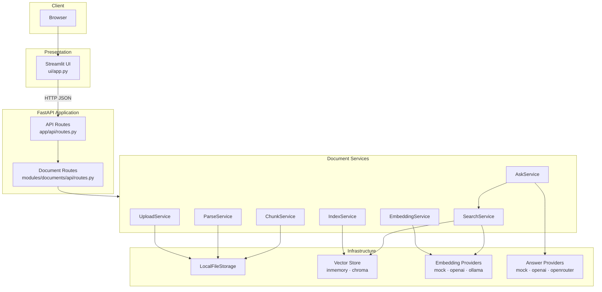
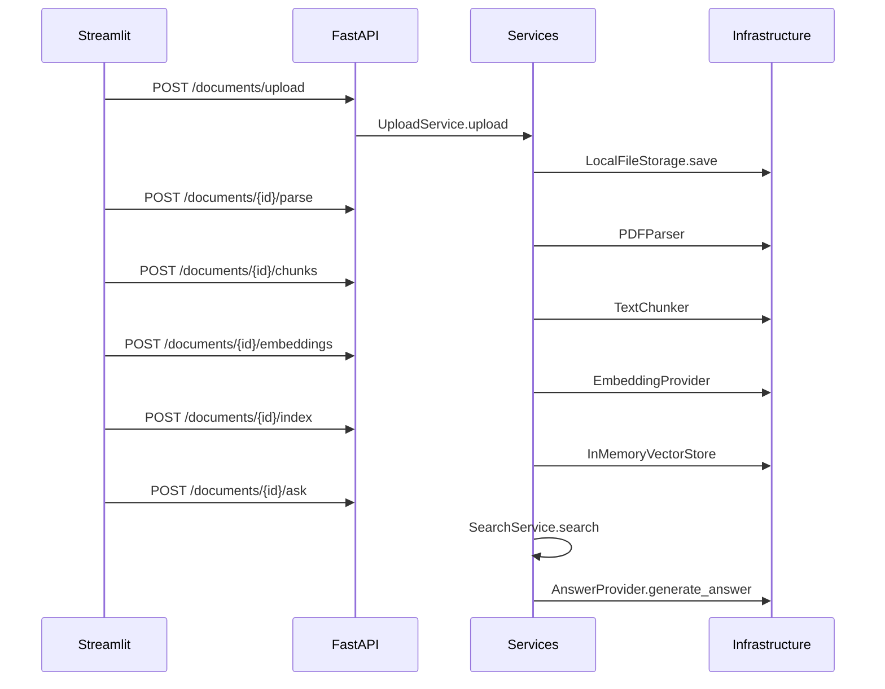
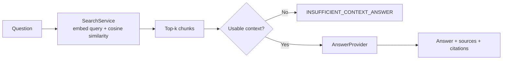

# Architecture

This document describes the current AI Presales platform architecture after the Streamlit demo, OpenRouter answer provider, status API, and provider refactor.

## System overview



## Layered design

The backend follows a strict layering model:

```text
API (routes)
    ↓
Services (business logic)
    ↓
Domain schemas & parsers/chunkers
    ↓
Infrastructure (storage, vector store, AI providers)
```

**Rules enforced in code:**

- API routes delegate to services; they do not call OpenAI or OpenRouter directly.
- AI providers implement small protocols (`EmbeddingProvider`, `AnswerProvider`).
- Provider selection is centralized in `app/core/dependencies.py`.
- Configuration is loaded once via `Settings` (`app/core/config.py`).

## Document processing pipeline



Each stage is a separate HTTP endpoint. The Streamlit client orchestrates the full pipeline through `ui/api_client.process_document()`.

## RAG ask flow



`AskService` (`app/modules/documents/services/ask_service.py`):

1. Runs semantic search with the question as the query.
2. Checks retrieved chunks with `has_usable_context()`.
3. Calls the configured answer provider or returns a fixed insufficient-context message.
4. Returns the answer with ranked source chunks, compact citations, and similarity scores.

## Traceable RAG and source metadata

Indexed chunks carry `SourceMetadata` from upload through search and ask:

| Field | Purpose |
| --- | --- |
| `document_id` / `document_name` | Link answers to the uploaded file |
| `page_number` | PDF page reference when chunking can infer it |
| `chunk_id` / `chunk_index` | Stable chunk identity in the vector store |
| `embedding_model` / `created_at` | Index-time audit fields |
| `project_id` / `project_name` | Workspace scope for multi-document retrieval |

Metadata is attached at embedding time (`EmbeddingService`), stored in ChromaDB via `metadata_to_chroma`, and returned on `SearchResult.metadata`. Answer providers receive formatted source blocks from `app/infrastructure/answers/prompts.py` (document, project, page, chunk, content). Citations are derived in `app/modules/documents/services/citations.py` without changing vector-store interfaces.

## Project workspace (US-017)

Projects group multiple PDFs under one analysis scope:

```text
Project → Documents → Chunks → Embeddings → Vector store
```

- Project metadata lives in `uploads/projects/{project_id}.project.json`.
- `POST /api/v1/projects/{id}/documents` uploads a PDF and runs parse → chunk → embed → index automatically.
- `POST /api/v1/projects/{id}/search` and `/ask` retrieve ranked chunks across all indexed documents in the project via `VectorStore.search_documents`.
- Legacy single-document endpoints under `/api/v1/documents/{document_id}/*` remain available.

The Streamlit UI uses project-scoped `/ask` for analyses and Q&A.

## Dependency injection

Infrastructure is built through cached factory functions in `app/core/dependencies.py`:

| Factory | Produces |
| --- | --- |
| `build_file_storage()` | `LocalFileStorage` |
| `build_embedding_provider()` | `MockEmbeddingProvider`, `OpenAIEmbeddingProvider`, or `OllamaEmbeddingProvider` |
| `build_vector_store()` | `InMemoryVectorStore` or `ChromaVectorStore` |
| `build_answer_provider()` | `MockAnswerProvider`, `OpenAIAnswerProvider`, or `OpenRouterAnswerProvider` |

FastAPI route handlers receive services via `Depends(get_*_service)`.

Provider instances are cached with `@lru_cache` on the build functions. Restart the server after changing `.env` provider settings.

## Configuration

All settings use the `AI_PRESALES_` environment prefix and Pydantic Settings (`app/core/config.py`).

Embedding and answer providers are **independent**. A common demo setup uses mock embeddings with OpenRouter answers to avoid embedding API costs while still generating LLM prose.

## Status API

`GET /api/v1/status` exposes runtime provider metadata without side effects. The Streamlit sidebar calls this endpoint after a successful health check to display the active embedding provider, answer provider, answer model, and vector store.

See [api.md](api.md#get-apiv1status), [ui.md — Sidebar](ui.md#sidebar), and [ui.md — Status endpoint](ui.md#status-endpoint).

## UI separation

The Streamlit app lives under `ui/` and communicates exclusively through HTTP (`ui/api_client.py`). This keeps the demo deployable as a separate process and prevents accidental coupling to FastAPI dependency injection or service imports.

## Related documentation

- [API reference](api.md)
- [Provider guide](providers.md)
- [Streamlit UI](ui.md)
- [Development guide](development.md)
