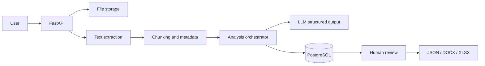

# Architecture

## Design principles

1. Evidence first: every important finding must reference the source.
2. Structured output: business objects are validated by Pydantic schemas.
3. Human in the loop: the model proposes; a reviewer approves.
4. Deterministic pipeline before agents: separate extraction, validation and synthesis stages.
5. Evaluation is part of the product, not a later enhancement.
6. Model portability: isolate provider-specific logic behind a service interface.
