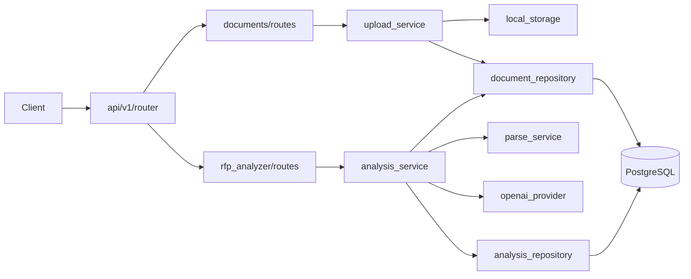

# AI Presales Platform — Revised MVP Architecture

Lean modular monolith. Three capabilities only: upload, parse, analyze. No jobs, no extra product modules, no speculative abstractions.

---

## Current-state observations

The repo is a thin scaffold: one router, Pydantic schemas masquerading as `models/`, a demo service, and no DB or LLM wiring. That is fine — the revision builds on what exists without adding future features.

**Keep from current code:**
- `/api/v1` prefix
- Pydantic analysis schemas (`AnalysisResult`, `Evidence`, etc.)
- Upload endpoint behavior (move logic out of routes)
- Demo analysis as a temporary stub until the real pipeline exists

**Fix now (structurally, not behaviorally):**
- Split `app/models/` (Pydantic) from future ORM entities
- Move business logic out of `routes.py`
- Introduce module boundaries for documents + rfp_analyzer only

**Defer entirely:**
- Discovery, Estimation, Proposals
- Background jobs / workers / Redis
- Vector search (not needed until retrieval-based analysis)
- Export beyond JSON response
- Evaluation harness (add after first real pipeline works)

---

## Proposed structure

```
AI-Presales/
├── app/
│   ├── main.py
│   │
│   ├── config/
│   │   └── settings.py                  # env: DB, OpenAI, upload limits
│   │
│   ├── api/
│   │   ├── deps.py                      # get_db, get_llm, get_storage
│   │   └── v1/
│   │       └── router.py                # mounts module routers
│   │
│   ├── core/
│   │   └── exceptions.py                # AppError → HTTP mapping
│   │
│   ├── shared/
│   │   └── schemas/
│   │       └── evidence.py              # Evidence, Severity (shared enums)
│   │
│   ├── infrastructure/
│   │   ├── database/
│   │   │   ├── base.py                  # SQLAlchemy DeclarativeBase
│   │   │   └── session.py               # engine + session factory
│   │   ├── llm/
│   │   │   ├── protocol.py              # LLMProvider Protocol
│   │   │   └── openai_provider.py       # first (only) provider for MVP
│   │   └── storage/
│   │       ├── protocol.py              # FileStorage Protocol
│   │       └── local_storage.py         # local filesystem
│   │
│   └── modules/
│       ├── documents/                   # Upload + Parse
│       │   ├── api/
│       │   │   └── routes.py
│       │   ├── schemas/
│       │   │   └── document.py            # upload request/response DTOs
│       │   ├── domain/
│       │   │   └── document.py          # Document entity (id, status, metadata)
│       │   ├── services/
│       │   │   ├── upload_service.py
│       │   │   └── parse_service.py     # orchestrates extractors
│       │   ├── parsers/
│       │   │   ├── pdf_parser.py
│       │   │   ├── docx_parser.py
│       │   │   └── txt_parser.py
│       │   └── repositories/
│       │       ├── orm.py               # Document ORM model
│       │       └── document_repository.py
│       │
│       └── rfp_analyzer/                # Analyze parsed text → structured output
│           ├── api/
│           │   └── routes.py
│           ├── schemas/
│           │   └── analysis.py          # AnalysisResult, Requirement, Risk, etc.
│           ├── domain/
│           │   └── analysis.py          # Analysis aggregate + status enum
│           ├── services/
│           │   ├── demo_analysis.py     # temporary stub
│           │   └── analysis_service.py  # real pipeline (extract → LLM → validate)
│           ├── prompts/
│           │   └── extract_analysis.py  # versioned prompt template
│           └── repositories/
│               ├── orm.py               # Analysis ORM model
│               └── analysis_repository.py
│
├── alembic/
│   └── versions/
│
├── tests/
│   ├── conftest.py                      # test client, db fixture, fake LLM
│   ├── unit/
│   │   ├── modules/documents/
│   │   └── modules/rfp_analyzer/
│   └── integration/
│       └── api/
│
├── docker-compose.yml                   # api + postgres (no redis, no worker)
├── requirements.txt
├── .env.example
├── docs/
├── AGENTS.md
└── README.md
```

### Folder responsibilities

| Path | Responsibility |
|---|---|
| `app/main.py` | FastAPI app, exception handlers, mount `/api/v1` |
| `app/config/` | All configuration via `pydantic-settings` |
| `app/api/` | Dependency injection and router assembly only |
| `app/core/` | Shared exceptions |
| `app/shared/schemas/` | Cross-module Pydantic primitives (`Evidence`, enums) |
| `app/infrastructure/` | Adapters: Postgres, OpenAI, local file storage |
| `app/modules/documents/` | Upload, validate, store file, parse to structured text |
| `app/modules/rfp_analyzer/` | Run LLM analysis on parsed text, persist and return result |
| `alembic/` | Database migrations |
| `tests/` | Unit tests for services/parsers; integration tests for API |

### Request flow (MVP — synchronous)



All work runs synchronously in the HTTP request. Acceptable for MVP document sizes (≤25 MB, target ≤100 pages per product scope).

---

## Migration plan

### Phase 1 — Skeleton (no new behavior)

| Action | Detail |
|---|---|
| Create | `config/settings.py`, `api/deps.py`, `api/v1/router.py`, `core/exceptions.py` |
| Refactor | `main.py` → mount `api/v1/router` |
| Create | `infrastructure/database/`, `infrastructure/llm/protocol.py`, `infrastructure/storage/` |
| Extend | `docker-compose.yml` → add Postgres service |
| Extend | `requirements.txt` → `sqlalchemy[asyncio]`, `asyncpg`, `alembic` |
| Extend | `.env.example` → `DATABASE_URL`, `OPENAI_API_KEY`, `OPENAI_MODEL` |

### Phase 2 — Documents module

| Action | Detail |
|---|---|
| Move | Upload logic from `app/api/routes.py` → `documents/services/upload_service.py` |
| Move | Upload route → `documents/api/routes.py` |
| Create | `parsers/` (pdf, docx, txt), `parse_service.py` |
| Create | `document_repository.py` + Alembic migration for `documents` table |
| Remove | Inline file I/O and validation from old routes |

### Phase 3 — RFP Analyzer module

| Action | Detail |
|---|---|
| Move | `app/models/analysis.py` → `rfp_analyzer/schemas/analysis.py` |
| Extract | `Evidence`, `Severity` → `shared/schemas/evidence.py` |
| Move | `app/services/demo_analysis.py` → `rfp_analyzer/services/demo_analysis.py` |
| Move | Demo route → `rfp_analyzer/api/routes.py` |
| Create | `analysis_service.py` — fetch document → parse → call LLM → validate → persist |
| Create | `prompts/extract_analysis.py`, `analysis_repository.py` + migration |
| Move | `tests/test_demo.py` → `tests/unit/modules/rfp_analyzer/` |

### Phase 4 — Cleanup

| Action | Detail |
|---|---|
| Remove | `app/api/routes.py`, `app/models/`, `app/services/` |
| Add | Integration test: upload → analyze → assert structured response with evidence |
| Update | `docs/architecture.md`, `README.md` |

### File disposition

| Current file | Action |
|---|---|
| `app/main.py` | Retain — refactor |
| `app/api/routes.py` | Split → remove |
| `app/models/analysis.py` | Move → `rfp_analyzer/schemas/` + extract shared parts |
| `app/services/demo_analysis.py` | Move → `rfp_analyzer/services/`; remove when real service works |
| `tests/test_demo.py` | Move → `tests/unit/modules/rfp_analyzer/` |
| `docs/*`, `AGENTS.md`, `README.md` | Retain — update |
| `docker-compose.yml` | Extend (Postgres only) |
| `.env.example`, `requirements.txt` | Extend |

---

## Key architectural decisions

### 1. Two feature modules, one deployable app

`documents` owns files and parsed text. `rfp_analyzer` owns analysis logic and results. No other modules until there is a working end-to-end flow.

### 2. Clean layering, minimal surface

```
API → Service → Domain → Repository → Database
         ↓
   Infrastructure (LLM, Storage)
```

Routes do not call repositories or LLM directly. Services orchestrate.

### 3. Three model types — only where needed

| Type | Where | MVP usage |
|---|---|---|
| Pydantic schemas | `modules/*/schemas/` | HTTP request/response |
| Domain entities | `modules/*/domain/` | Status, invariants (`DocumentStatus`, `AnalysisStatus`) |
| SQLAlchemy ORM | `modules/*/repositories/orm.py` | Persistence |

No separate DTO layer. No Unit of Work. Repositories are plain classes with a session.

### 4. LLM abstraction — one protocol, one provider

```python
class LLMProvider(Protocol):
    async def structured_output[T](
        self, *, system: str, user: str, schema: type[T]
    ) -> T: ...
```

MVP ships with `OpenAIProvider` only. Adding Anthropic later means one new file in `infrastructure/llm/`, no module changes.

Prompts live in `rfp_analyzer/prompts/`, not inline in services.

### 5. Synchronous pipeline

`POST /api/v1/documents/{id}/analyze` runs upload → parse → LLM → persist in one request. No job queue, no Redis, no worker process. Revisit only when latency or timeouts force it.

### 6. PostgreSQL — relational only, no pgvector

MVP tables:

- `documents` — id, filename, mime, size, storage_path, status, parsed_text (JSONB), created_at
- `analyses` — id, document_id, result (JSONB), confidence, created_at

Parsed text stored as JSONB with page/section metadata. No embeddings, no chunk table, no vector index.

### 7. Local file storage behind a protocol

`FileStorage` protocol with `LocalFileStorage` implementation. Swap to S3 later without touching services.

### 8. API surface (MVP)

| Method | Path | Purpose |
|---|---|---|
| `GET` | `/health` | Liveness |
| `POST` | `/api/v1/documents/upload` | Upload file |
| `GET` | `/api/v1/documents/{id}` | Document metadata + parse status |
| `POST` | `/api/v1/documents/{id}/analyze` | Run analysis (sync) |
| `GET` | `/api/v1/analyses/{id}` | Fetch analysis result |
| `POST` | `/api/v1/analysis/demo` | Stub (remove when real pipeline is tested) |

### 9. Module dependency rule

`rfp_analyzer` may call `documents` services (to fetch/parse). `documents` must not import from `rfp_analyzer`.

### 10. Testing — two tiers only

- **Unit:** parsers, services (fake LLM, in-memory storage)
- **Integration:** API endpoints against test Postgres

No evaluation corpus, no background job tests.

---

## Risks and trade-offs

| Decision | Trade-off | When to revisit |
|---|---|---|
| No background jobs | Long analyses block HTTP; risk of timeout on large docs | P95 latency > 30s or frequent timeouts |
| No pgvector | Full document sent to LLM context; cost/limit on very large RFPs | Documents routinely exceed model context window |
| No stub modules | Adding Discovery/Estimation later requires new folders | When MVP analysis is stable and next feature is scoped |
| Sync-only Postgres | Simple ops, one service in compose | Never for MVP |
| Local file storage | Not production-ready | Before any shared/staging deployment |
| Demo endpoint kept temporarily | Two code paths during transition | Remove once `analysis_service` passes integration tests |
| JSONB for parsed text + results | Flexible schema, weak queryability on nested fields | When you need search/filter on individual requirements |
| Single LLM provider impl | Vendor lock-in at infra layer only | When second provider is a business requirement |

### What was removed (and why)

| Removed | Reason |
|---|---|
| `discovery/`, `estimation/`, `proposals/` modules | Not in MVP scope |
| `infrastructure/jobs/`, Redis, worker | No async work yet; YAGNI |
| `infrastructure/vector/`, pgvector | No retrieval pipeline in MVP |
| `infrastructure/export/` | JSON in API response is enough |
| `shared/domain/identifiers.py` | UUID strings suffice |
| `core/logging.py`, `core/types.py` | stdlib logging + plain types until needed |
| `scripts/`, `docker/Dockerfile` | Compose + README commands enough for now |
| `requirements-dev.txt`, `pyproject.toml` | Add when linting/type-checking is enforced in CI |
| Unit of Work, registry patterns | One repo per aggregate is sufficient |

---

This revision keeps modular boundaries and clean architecture without building for features that do not exist yet. The first milestone is: **upload a document → parse it → get a structured, evidence-backed analysis back.**