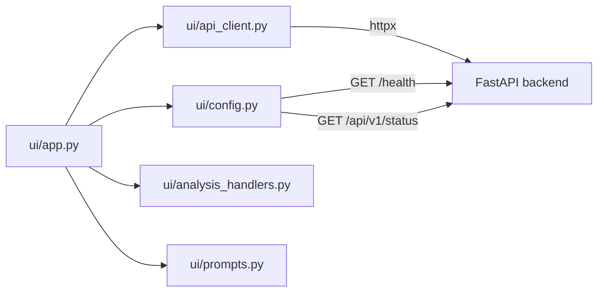

# Streamlit UI

The demo UI lives under `ui/` and communicates with the FastAPI backend exclusively over HTTP. It does not import `app` modules.

**Entry point:** `ui/app.py`

**Default URL:** http://localhost:8501

## Architecture



## Upload flow

1. User selects a PDF via `st.file_uploader` (PDF only).
2. File name and size are displayed.
3. User clicks **Process Document**.
4. `process_document()` in `ui/api_client.py` runs the pipeline:
   - Uploading… → `POST /api/v1/documents/upload`
   - Parsing… → `POST /api/v1/documents/{id}/parse`
   - Creating chunks… → `POST /api/v1/documents/{id}/chunks`
   - Generating embeddings… → `POST /api/v1/documents/{id}/embeddings`
   - Indexing… → `POST /api/v1/documents/{id}/index`
   - Ready. → `GET /api/v1/documents/{id}` for final metadata
5. Progress bar and status text update after each stage.
6. On success, session state stores `document_id`, filename, size, and chunk count.
7. Previous analysis results are cleared for the new document.

**Error handling:**

| HTTP status | UI message |
| --- | --- |
| Backend unreachable | Start FastAPI on port 8000 |
| `415` | Unsupported file type |
| `413` | File too large |
| `422` | Document processing failed (invalid/empty PDF) |

## Processing flow

The UI does not expose individual pipeline steps. **Process Document** runs all stages sequentially through the HTTP client.

To call stages individually, use the API directly (see [api.md](api.md)) or extend `ui/api_client.py`.

## Analysis dashboard

After a document is processed, **Step 2 — Analyze** shows seven preset analysis buttons:

| Button | Prompt sent to `/ask` |
| --- | --- |
| Executive Summary | Generate an executive summary of this RFP. |
| Requirements | Extract all functional and non-functional requirements… |
| Risks | Identify delivery and commercial risks… |
| Clarification Questions | Generate clarification questions… |
| Assumptions | Generate proposal assumptions… |
| Cost Drivers | Identify factors that increase implementation effort… |
| Delivery Phases | Propose a high-level delivery plan… |

Prompts are defined in `ui/prompts.py` (`ANALYSIS_LABELS`, `ANALYSIS_PROMPTS`).

**Behavior:**

- Each button calls `run_analysis_for_label()` in `ui/analysis_handlers.py`.
- That function sends the preset prompt to `POST /api/v1/documents/{id}/ask` via `run_preset_analysis()`.
- Default retrieval count is controlled by the **Analysis top_k** slider (1–20, default 10).
- Results appear under **Analysis Results** expanders with answer text and source chunks.
- Buttons use unique Streamlit keys (`analysis_button_{slug}`) to avoid widget conflicts.
- Errors are stored per label in `analysis_errors` and shown inline.

There is no separate analysis API endpoint. The dashboard is a UX layer over `/ask`.

## Custom Q&A

**Step 3 — Ask the RFP** provides a free-form question area:

- Submits to `POST /api/v1/documents/{id}/ask` through `ask_question()`.
- **Ask top_k** slider controls retrieval (default 5).
- Answer and source chunks render below the question.
- Last answer persists in session state when the question field is cleared.

## Sidebar

The sidebar shows:

| Item | Source |
| --- | --- |
| Backend URL | `UiSettings.api_base_url` |
| Connection status | `GET /health` |
| Document name / ID | Session state |
| Processing status | Session state |
| Embedding provider | Backend status (or env fallback) |
| Answer provider | Backend status (or env fallback) |
| Answer model | Backend status (or env fallback) |
| Vector store | Backend status (or env fallback) |
| Chunk count | Session state (after processing) |

## Status endpoint

When the backend is reachable:

1. `check_health()` calls `GET /health`.
2. `get_platform_status()` calls `GET /api/v1/status`.
3. `apply_backend_status()` merges provider metadata into `UiSettings`.

This ensures the sidebar reflects the **running backend's** configuration, not only local UI environment variables.

If the backend is down, the sidebar shows an error and falls back to env-based provider labels from `get_ui_settings()`.

## Session state

Initialized in `_init_session_state()`:

| Key | Purpose |
| --- | --- |
| `document_id` | Active document UUID |
| `filename` | Uploaded file name |
| `file_size` | Size in bytes |
| `chunk_count` | Chunks from processing |
| `processing_status` | Current pipeline stage label |
| `analysis_results` | Dict of label → `/ask` response payload |
| `analysis_errors` | Dict of label → error message |
| `last_question` | Previous custom question |
| `last_answer` | Previous custom `/ask` response |

Streamlit requires dict reassignment after mutation. Analysis handlers return new dicts rather than mutating in place.

## Configuration

UI settings are loaded in `ui/config.py`. These variables are **not** defined in `app/core/config.py`; they configure the Streamlit HTTP client only.

| Variable | Default | Description |
| --- | --- | --- |
| `AI_PRESALES_API_BASE_URL` | `http://localhost:8000` | Backend base URL |
| `AI_PRESALES_UI_REQUEST_TIMEOUT` | `60` | HTTP timeout in seconds |
| `AI_PRESALES_EMBEDDING_PROVIDER` | `mock` | Fallback when status API unavailable |
| `AI_PRESALES_ANSWER_PROVIDER` | `mock` | Fallback when status API unavailable |

Answer model fallback is derived from env vars when status is unavailable. Backend provider settings are documented in [providers.md](providers.md#configuration-reference).

## Running the UI

```bash
# Terminal 1 — backend
uvicorn app.main:app --reload

# Terminal 2 — UI
streamlit run ui/app.py
```

Or use `./scripts/run_demo.sh` to start both processes.

## HTTP client

`ui/api_client.py` wraps httpx with:

- `ApiClientError` — backend returned 4xx/5xx
- `BackendUnavailableError` — connection or timeout failure
- Typed helpers for each API endpoint
- `process_document()` orchestration with optional progress callback

## Related documentation

- [API reference](api.md)
- [Architecture](architecture.md)
- [Development — add analysis type](development.md#add-a-new-analysis-type)
